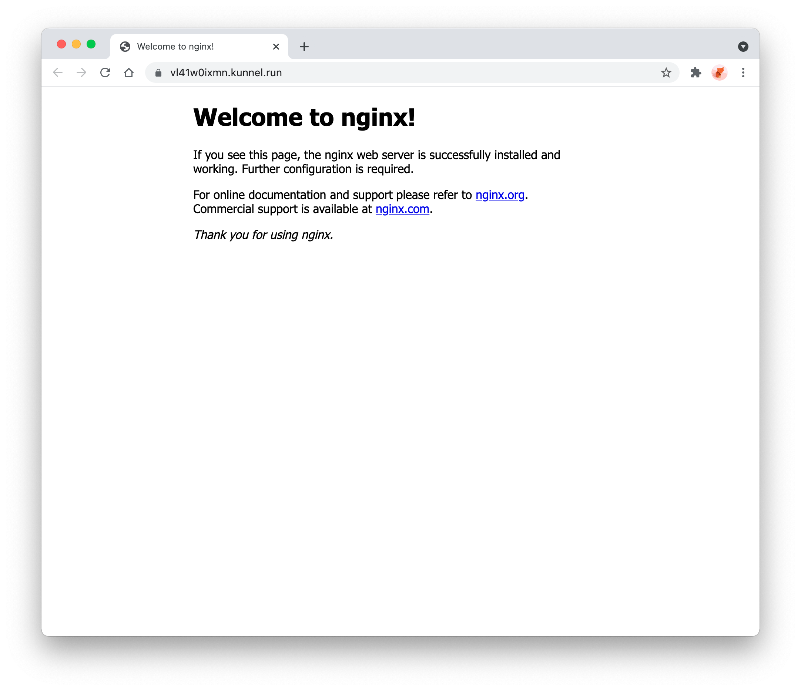

## Kunnel
Kunnel is short for **Kubernetes tunnel**, built for exposing Kubernetes service to outside the cluster without LoadBalancer or NodePort.

## Install

### Binaries
You can download releases directly from [Release Page](https://github.com/zryfish/kunnel/releases)

### Build from source
```
git clone https://github.com/zryfish/kunnel.git
cd kunnel
make all
```
Binaries `server` and `kn` will be found under directory `bin/`.

## How to run

### Proxy kubernetes service
It's easy to proxy service of Kubernetes. Suppose you have an `nginx` service under namespace `default`.

```shell
root@master:~# kubectl get svc
NAME         TYPE        CLUSTER-IP      EXTERNAL-IP   PORT(S)   AGE
kubernetes   ClusterIP   10.233.0.1      <none>        443/TCP   11d
nginx        ClusterIP   10.233.48.225   <none>        80/TCP    8s
```

To proxy `nginx` service, just simply run the following command in your cluster.
```
root@master:~# ./kn -n default -s nginx
W0906 07:48:19.298922   16910 main.go:58] No port specified, will use first port [80] of service
I0906 07:48:19.339564   16910 client.go:180] Service available at https://vl41w0ixmn.kunnel.run
```

Now, you can access your nginx service through the address `https://vl41w0ixmn.kunnel.run`. Like the following:



> To run proxy background, just add the option `-d`. For example `./kn -n default -s nginx -d`. It will create a deployment in your cluster under the namespace given.


### Proxy for ingress 
Kunnel can proxy requestes for virtualhosts. For example, my ingress controller service under namespace `kubesphere-controls-system`, there is an ingress rule with host `foo.bar`.
```
root@master:~# kubectl -n kubesphere-controls-system get svc
NAME                             TYPE        CLUSTER-IP      EXTERNAL-IP   PORT(S)                      AGE
kubesphere-router-test           NodePort    10.233.14.239   <none>        80:32360/TCP,443:32604/TCP   2m21s

root@master:~# kubectl -n test get ing
NAME   CLASS    HOSTS     ADDRESS        PORTS   AGE
test   <none>   foo.bar   192.168.0.14   80      5m4s
```

To proxy requests for rule `test` with Host `foo.bar`, start `kunnel` with host override by specifying `--host foo.bar`

We can create a tunnel for ingress controller by following:
```
root@master:~# ./kn -n kubesphere-controls-system -s kubesphere-router-test --host foo.bar -d
root@master:~# kubectl -n kubesphere-controls-system logs -lapp=kunnel
I0906 08:13:28.258512       1 client.go:180] Service available at https://3fc3p231wj.kunnel.run
```

Now we can access ingress rule `test` through the address `https://3fc3p231wj.kunnel.run`.

## Kubectl plugin
We are working to merge `kunnel` into [krew](https://github.com/kubernetes-sigs/krew)

## Don't use `kunnel.run` in production
Don't use the domain `kunnel.run` in your production evnironment, cause we may need bring it down for maintenance. You could setup a server on your own proxy domain.
